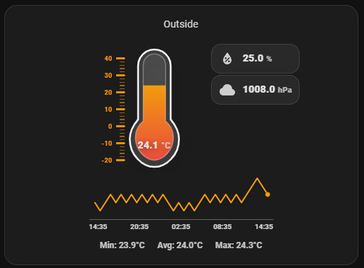
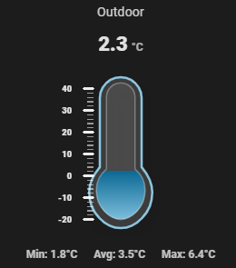
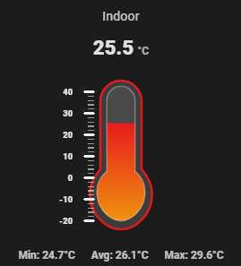

# Andy Temperature Card v1.0.5
Andy Temperature Card is a sleek Lovelace custom card that visualizes a numeric sensor value as a modern thermometer.
It supports configurable min/max scaling, optional tick marks, optional Min/Avg/Max statistics (via Home Assistant history), and powerful color styling through value intervals.






> **Recommended installation method:** HACS  
> Manual installation is supported but not recommended unless HACS is unavailable


Key features:
- Thermometer visualization with a clean, modern look
- Numeric entities (works with any entity whose state is a number)
- Configurable value placement (top/bottom/inside)
- Intervals with per-range styling
-- Solid fill color or optional gradient
-- Per-interval outline color
- Optional glass effect
- Optional scale ticks (locked/consistent geometry)
- Optional Min/Avg/Max statistics (lookback hours configurable)
- Built-in visual editor UI (no YAML required, but supported)
- Support for 3 extra Entity information
- Click on entity support
- Show Graph

Notes:
The stats feature uses the REST history endpoint via hass.callApi("GET", "history/period/...").
Runs fully in the browser (no backend).

## Installation

### Option A — Install via HACS (published repository)
1. Open **HACS** in Home Assistant.
2. Go to **Frontend**.
3. Search for **Andy Temperature Card**.
4. Open the card and click **Download**.
5. Restart Home Assistant (or reload frontend resources).

After installation, the Lovelace resource is usually added automatically by HACS.  
If not, see **“Add as a resource”** below.

---

### Option B — Install via HACS (custom repository)
Use this method if the card is not yet listed in the HACS store.

1. Open **HACS** in Home Assistant.
2. Click the **⋮ (three dots)** menu in the top right.
3. Select **Custom repositories**.
4. Add the repository:
   - **Repository**: `https://github.com/maglerod/andy-temperature-card`
   - **Category**: **Lovelace**
5. Click **Add**.
6. Go to **Frontend** in HACS.
7. Search for **Andy Temperature Card**.
8. Click **Download**.
9. Restart Home Assistant (or reload frontend resources).

---

### Option C — Manual installation (no HACS)
1. Download `andy-temperature-card.js` from this repository.
2. Copy the file to your Home Assistant configuration directory: /config/www/andy-temperature-card.js

### Add as a resource (if needed)
If the card does not appear automatically:

1. Go to **Settings → Dashboards → Resources**
2. Click **Add Resource**
3. Enter:
- **URL**: `/local/andy-temperature-card.js?v=20260101-101`
- **Resource type**: `JavaScript Module`
4. Save and perform a **hard refresh** in your browser (`Ctrl+F5` / `Cmd+Shift+R`).

---

### Add the card to a dashboard

#### Using the UI editor
1. Open your dashboard → **Edit dashboard**
2. Click **Add card**
3. Search for **Andy Temperature Card**
4. Configure the card and save

#### Using YAML
```yaml
name: Temperature
entity: sensor.your_temperature_sensor
min: -20
max: 40
unit: ""
decimals: 1
value_position: top_right
value_font_size: 0
glass: true
show_scale: false
show_stats: false
stats_hours: 24
intervals:
  - to: 0
    color: "#2b6cff"
    outline: "#ffffff"
    gradient:
      enabled: false
      from: "#2b6cff"
      to: "#2b6cff"
  - to: 10
    color: "#39c0ff"
    outline: "#ffffff"
    gradient:
      enabled: false
      from: "#39c0ff"
      to: "#39c0ff"
  - to: 20
    color: "#22c55e"
    outline: "#ffffff"
    gradient:
      enabled: false
      from: "#22c55e"
      to: "#22c55e"
  - to: 30
    color: "#f59e0b"
    outline: "#ffffff"
    gradient:
      enabled: false
      from: "#f59e0b"
      to: "#f59e0b"
  - to: 100
    color: "#ef4444"
    outline: "#ffffff"
    gradient:
      enabled: false
      from: "#ef4444"
      to: "#ef4444"
type: custom:andy-temperature-card
```

## ☕ Support the project 
[](https://buymeacoffee.com/andybonde)

